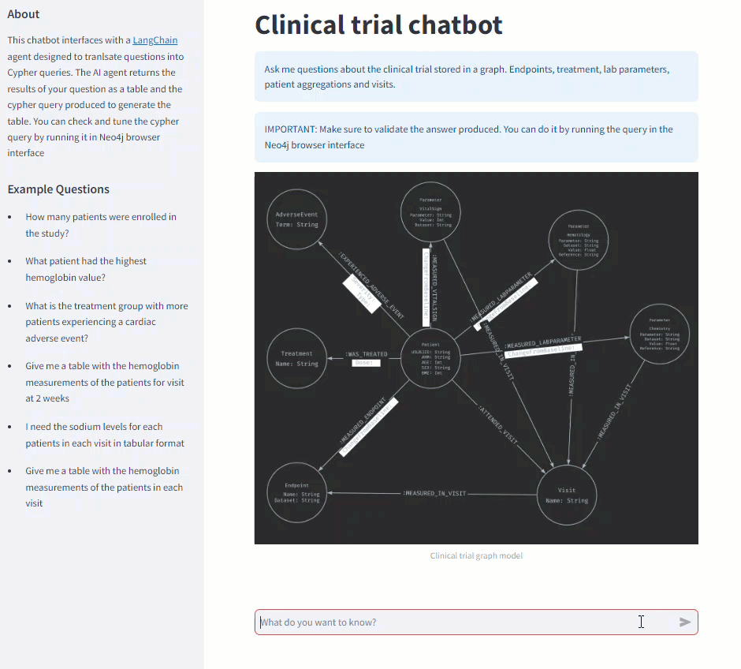

# Clinical Data Manager AI Assistant

Clinical trial data and metadata is often stored and exchanged in a standard format known as AdAM (Analysis Data Model) which contains multiple files categories of clinical parameters measured in patients at different points of the clinical trial.
In order to navigate this data one needs to be knowledgable of SQL and proficient in table joins and import multiple files or tables everytime a new analysis is requested.
Knowledge graphs on the other hand allows us to explore highly linked data in a more understandable and efficient way. However, in order to query graphs you need to knnow Cypher language.
This is where we can leverage the power of Large Language Models (LLMs) and completely abstract data managers from the complexity of querying a knowledge graph using natural language. Tools such as CypherQAchains of the Langchain framework greatly simplify the effort of developing AI applications for this purpose.


## Description

This project is an end-to-end data engineering and generative AI stack written primarily Python with a touch of Cypher. The user is presented with an application where can ask analytical questions about the clinical trial graph model and returns an answer as an exportable table along with the Cypher query generated to produce the result. As a PoC it does not export large tables but only the first rows.
The stack consists of a Neo4j as graph database for the clinical trial data, a Python a Langchain cypherQA backend with a FastAPI as REST API, a highly configurable Prefect ETL data pipeline that populates the database and a Streamlit frontend application.
The clinical trial data is a sample from a CDISC pilot study kindly made availale by the PHUSE consortium which you can clone from their repository:
https://github.com/phuse-org/phuse-scripts/tree/master/data/adam/cdiscpilot01

```
├── data
├── docker-compose.yml
├── etl
│   ├── Classes.py
│   ├── Dockerfile.etl
│   ├── ETLfunctions.py
│   ├── GraphETLpipeline.py
│   ├── __init__.py
│   ├── pipeline_config.yaml
├── frontend
│   ├── AdamGraph.png
│   ├── app.py
│   └── Dockerfile.frontend
├── launch.sh
├── neo4j
│   ├── Dockerfile.neo4j
│   └── neo4j.conf
├── queries.cypher
├── Readm.md
├── requirements.txt
└── src
    ├── cypherQAchain
    │   ├── cypher_chain.py
    │   ├── __init__.py
    ├── Dockerfile.langchain
    ├── main.py
    └── requirements.txt
```

## Getting Started

### Dependencies

* Ubuntu 22.04
* Docker version 24.0.4
* Docker Compose version v2.23.1

### Installing

* Clone the reposiory
* Create and .env file in the root directory and set the following variables:
    NEO4J_URI=neo4j://neo4j:7687
    NEO4J_USER=your_neo4j_user
    NEO4J_PASSWORD=nyour_neo4j_password
    OPENAI_API_KEY=your_openai_api_key
    CHATBOT_URL=http://localhost:8001/graph-question

* Execute the launch.sh script
``` bash
sudo bash launch.sh
```

### Executing program

* Once the containers are running you need to initiate the ETL pipeline manually to populate the graph
* Open a new shell and find the container with the Prefect ETL pipeline running the command
``` bash
sudo docker ps -qf "ancestor=adamgraph-etl"
```
* Open the shell in the container id obtained
``` bash
sudo docker exec -it <container_id> /bin/bash
```
* Once the container shell is open run the Prefect ETL pipeline by executing this command
``` bash 
prefect deployment run 'create-graph-flow/GraphETLdeployment'
```
* Exit the container shell
``` bash
exit
```
* Exit the container shell

## Help

The ETL pipeline can be configured to only write certain nodes or parts of the model. This can become handy to either extend the graph or modify parts of it.

## Authors

* Dario Vazquez - Senior Data Engineer

## Version History

* 0.1
    * Initial version

## Acknowledgments

* PHUSE consortium for great contribution to open-source clinical data standards
* Real Python for great insipiration tutorials for this project: https://realpython.com/build-llm-rag-chatbot-with-langchain/
